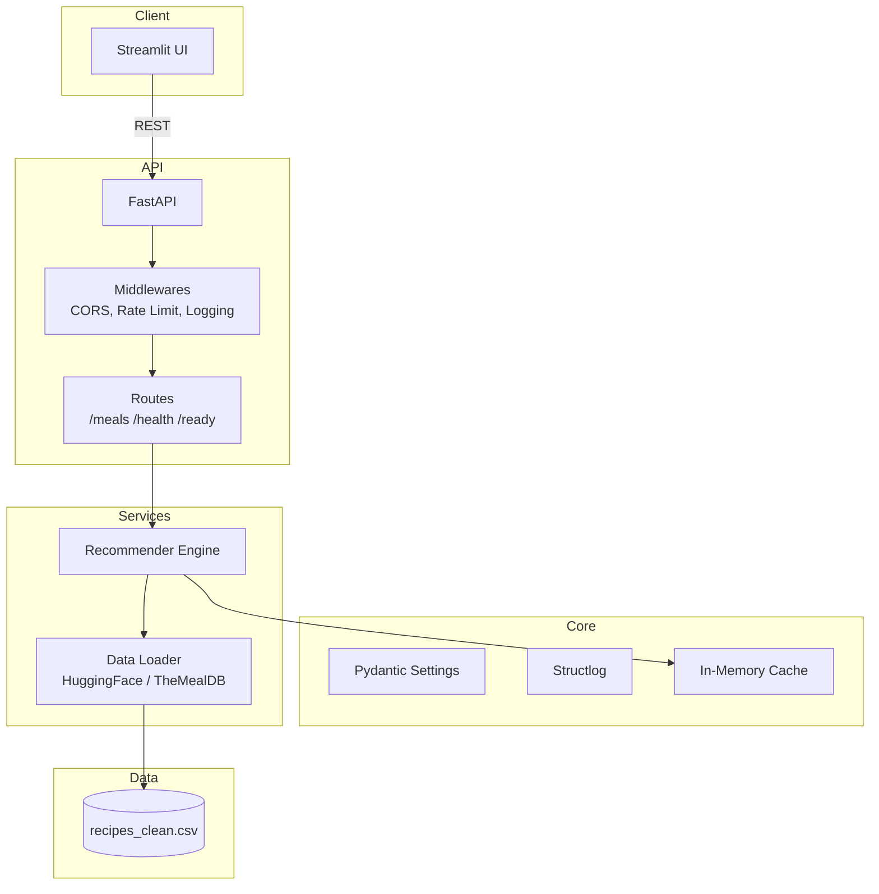

# Meal Recommender API

[](https://github.com/BucKz96/meal-recommander-api/actions/workflows/test.yml)
[](https://www.python.org/downloads/)
[](https://fastapi.tiangolo.com)
[](LICENSE)
[](https://www.docker.com/)

API intelligente de recommandation de repas basée sur les ingrédients disponibles. Backend en FastAPI avec cache mémoire, rate limiting et observabilité intégrée. Interface Streamlit moderne avec thème clair/sombre, favoris et historique de recherche.

<p align="center">
  
</p>

---

## ✨ Fonctionnalités

- **Recommandation par ingrédients** - Algorithme de matching intelligent avec scoring de pertinence
- **Cache mémoire TTL** - Performance optimale sans rechargement CSV à chaque requête
- **Rate limiting** - Protection API avec SlowAPI (limites configurables)
- **Interface moderne** - Streamlit avec thème dynamique, animations et responsive design
- **Favoris & Historique** - Persistance côté client pour une expérience fluide
- **Health checks** - Endpoints `/health` et `/ready` pour monitoring (Kubernetes, Render)
- **Documentation auto** - Swagger UI et ReDoc générés automatiquement
- **Tests automatisés** - Pytest avec 80%+ coverage (unit + integration)
- **Docker multi-stage** - Images optimisées, non-root user, health checks

---

## 🏗️ Architecture



---

## 🚀 Démarrage rapide

### Prérequis

- Python 3.11+
- Docker (optionnel)

### Installation locale

```bash
git clone https://github.com/BucKz96/meal-recommander-api.git
cd meal-recommander-api

python -m venv .venv
source .venv/bin/activate  # Windows: .venv\Scripts\activate
pip install -e ".[dev]"
```

### Lancement

```bash
# Terminal 1 - API
make run-api

# Terminal 2 - Streamlit
make run-streamlit
```

- API: http://localhost:8000
- Streamlit: http://localhost:8501
- Swagger: http://localhost:8000/docs

### Docker Compose

```bash
docker-compose up --build
```

---

## 📡 API Endpoints

| Méthode | Endpoint | Description |
|---------|----------|-------------|
| GET | `/` | Message de bienvenue + métadonnées |
| GET | `/meals/by-ingredients` | Recommandations par ingrédients |
| GET | `/meals/all` | Tous les repas (filtre cuisine optionnel) |
| GET | `/meals/sample` | Échantillon pour démo |
| GET | `/health` | Health check avec stats cache |
| GET | `/ready` | Readiness probe |

### Exemple d'utilisation

```bash
curl "http://localhost:8000/meals/by-ingredients?available_ingredients=chicken&available_ingredients=rice&limit=10"
```

```json
[
  {
    "name": "Chicken Fried Rice",
    "ingredients": ["chicken", "rice", "eggs", "soy sauce"],
    "cuisine": "asian",
    "nutritions": {
      "calories": 450.5,
      "protein": 32.1,
      "fat": 12.3,
      "carbohydrates": 58.2
    },
    "prep_time": "30 minutes or less"
  }
]
```

---

## 🧪 Tests & Qualité

```bash
# Linter + formatage
make lint
make format

# Tests
make test           # Tests rapides
make test-cov       # Avec couverture HTML

# Docker
make docker-build
make docker-up
```

---

## 🛠️ Stack technique

| Domaine | Technologies |
|---------|-------------|
| API | FastAPI, Pydantic v2, Uvicorn |
| Sécurité | SlowAPI, CORS middleware |
| Data | Pandas, NumPy, HuggingFace Datasets |
| Logging | Structlog (JSON/texte) |
| Frontend | Streamlit, CSS custom |
| Tests | Pytest, pytest-cov, Ruff, MyPy |
| DevOps | Docker multi-stage, GitHub Actions |

---

## 📊 Dataset

Deux sources de données supportées :

1. **TheMealDB** (défaut) - ~300 recettes avec images
2. **HuggingFace** - Dataset recipes_clean.csv nettoyé

Configuration via variables d'environnement :

```bash
DATA_SOURCE=mealdb  # ou 'csv'
CACHE_TTL_SECONDS=3600
API_RATE_LIMIT_PER_MINUTE=100
```

---

## 🗺️ Roadmap

- [ ] Authentification JWT
- [ ] Base PostgreSQL pour favoris persistants
- [ ] Pagination des résultats
- [ ] Filtrage par régime alimentaire (vegan, keto, etc.)
- [ ] Suggestions "repas de la semaine"

---

## 📄 Licence

MIT License - voir [LICENSE](LICENSE)

---

<p align="center">
  Développé avec 🍽️ par <a href="https://github.com/BucKz96">@BucKz96</a>
</p>
